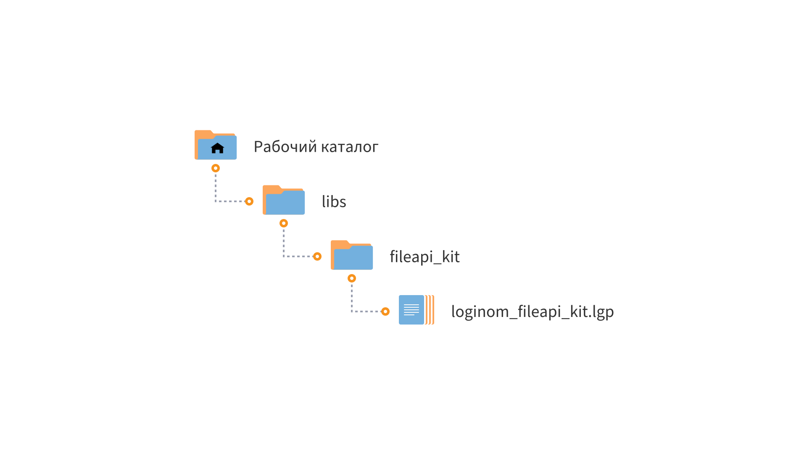

# Loginom FileApi Kit

* Версия: 1.0.1
* Проверено: Все редакции Loginom от 6.5.5

Библиотека **Loginom FileApi Kit** поддерживается и развивается Loginom Company. В ней представлены простые и полезные компоненты для работы с файловой системой. В зависимости от версии, если версия десктопная, то с файловой системой ОС, если серверная, то работа производится с [Loginom FileStorage](https://help.loginom.ru/userguide/location_user_files.html).

## Установка

1. Распакуйте архив **loginom-fileapi-kit.zip**
2. Поместите папку **fileapi_kit**:

    * Для серверных редакций — в рабочий каталог Loginom Server (в папку пользователя или в общую папку пользователей);
    * Для настольных редакций — в любую на локальном диске

3. Добавьте ссылку на пакет **loginom_fileapi_kit.lgp** в своем пакете и используйте компоненты библиотеки

## Требования

Для работы библиотеки **Loginom FileApi Kit** необходимо:

*  Установленное ПО Loginom. Версия не ниже 6.5.5

## Список компонентов

* [Список файлов](./docs/list-of-files.md)
* [Проверка пути](./docs/check-path.md)
* [Копировать файл](./docs/copy-file.md)
* [Переместить файл](./docs/move-file.md)
* [Удалить файл](./docs/delete-file.md)
* [Переименовать файл или папку](./docs/rename-object.md)
* [Копировать папку](./docs/copy-folder.md)
* [Переместить папку](./docs/move-folder.md)
* [Удалить папку](./docs/delete-folder.md)
* [Создать папку](./docs/create-folder.md)
* [Копировать список файлов](./docs/copy-files-list.md)
* [Переместить список файлов](./docs/move-files-list.md)
* [Архивировать папку](./docs/archive-folder.md)

## Прочее

[Кейс использования](./docs/use-case.md).

