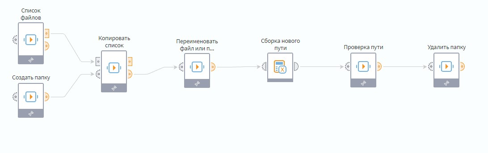

# Кейс использования

Данный кейс демонстрирует применение библиотеки [FileApi Kit](../README.md) в повседневных задачах с файловой системой.

1. Компонент [**Список объектов**](list-of-objects.md) формирует список объектов по пути в котором располагается библиотека. Параллельно с этим создается новая папка с помощью компонента [**Создать папку**](create-folder.md). 

2. С помощью компонента [**Копировать список**](copy-files-list.md) в новую папку копируется ранее полученный список файлов  

3. Компонент [**Переименовать файл или папку**](rename-object.md) переименовывает заданную папку.

5. В узле [**Сборка нового пути**](https://help.loginom.ru/userguide/processors/transformation/calc/) с помощью калькулятора собирается путь к переименованной папке.

6. Компонент [**Проверка пути**](check-path.md) проверяет ранее собранный путь. 

7. Новая папка с файлами удаляется через компонент [**Удалить папку**](delete-folder.md) и файловая система возвращается к исходному состоянию.

